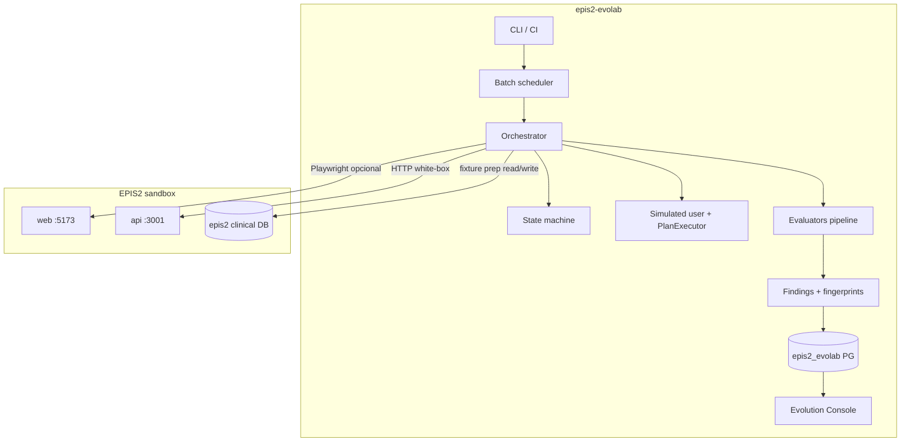

# EPIS2 Evolab — Plan de mejora (eficiencia · rapidez · potencia · profundidad)

**Versión:** 1.0  
**Fecha:** 2026-06-09  
**Repo:** [epis2-evolab](https://github.com/gabriel2320/epis2-evolab)  
**Target clínico:** [epis2](https://github.com/gabriel2320/epis2) (sandbox HTTP, sin acoplamiento de código)

---

## 1. Resumen ejecutivo

Evolab completó el MVP (FASE 0–10): orquestador, PostgreSQL, evaluadores, replay, LLM plan/execute piloto y consola read-only. El siguiente ciclo convierte el laboratorio en un **motor de evolución continua** sobre EPIS2: más escenarios por hora, más señal clínica por run, y un camino supervisado hacia tests y parches candidatos.

### Cuatro ejes

| Eje | Objetivo | Indicador north-star |
|-----|----------|----------------------|
| **Eficiencia** | Menos costo por run (tiempo, I/O, LLM, browser) | Costo medio por escenario ↓ 50% |
| **Rapidez** | Más throughput batch/CI | `--all` 4 escenarios &lt; 3 min (API-first) |
| **Potencia** | Más capacidades del loop Evolab | ≥80% escenarios con evaluadores compuestos |
| **Profundidad** | Más cobertura clínica realista | Catálogo ≥15 escenarios · 3 journeys multi-paso |

### Baseline actual (MVP)

| Métrica | Valor referencia |
|---------|------------------|
| Escenarios YAML | 4 |
| Tests unitarios | 383 |
| Modo default | API-first (`BROWSER=false`) |
| LLM | Piloto `llm-command-evolution-001` |
| Persistencia | PostgreSQL `epis2_evolab` + filesystem |
| Consola | Read-only MVP (puerto 5190) |

---

## 2. Principios de diseño (no negociables)

1. **EPIS2 no conoce Evolab** — solo HTTP/Playwright sobre sandbox; cualquier hook de fault injection en EPIS2 debe estar **off por defecto** y documentado aparte.
2. **API-first, browser on demand** — Playwright solo cuando el evaluador lo exige (`dom_state`, journey UI).
3. **Determinismo antes que LLM** — el orquestador y la state machine mandan; el LLM propone planes, no estados.
4. **Evidencia barata, señal cara** — capturar todo en disco solo cuando falla o en modo debug.
5. **Human-in-the-loop** para hallazgos clínicos, test candidates y patch candidates.
6. **Reproducibilidad** — seed + replay + fingerprint en cada finding.

---

## 3. Arquitectura objetivo



### Capas de mejora

| Capa | Mejora principal |
|------|------------------|
| **Scheduler** | Paralelismo, cola, prioridades, CI matrix |
| **Target adapter** | Health gate, session reuse, retry policy |
| **Execution** | API path · browser pool · plan híbrido |
| **Observation** | Captura selectiva, correlación API↔DOM |
| **Evaluation** | Evaluadores modulares, composición por tags |
| **Evolution** | Test candidates · patch proposals · trends |

---

## 4. Roadmap por fases

### FASE 11 — Eficiencia operativa (2–3 semanas)

**Meta:** reducir fricción y tiempo muerto en runs diarios.

| ID | Entregable | Detalle técnico | Criterio de aceptación |
|----|------------|-----------------|------------------------|
| 11.1 | **Batch paralelo** | `evolab:run --all --parallel 2` con límite por target health | 4 escenarios API-first en &lt; 5 min local |
| 11.2 | **Preflight target** | `doctor` + run: ping API/web, versión, DB demo, Ollama opcional | Falla rápido con mensaje accionable |
| 11.3 | **Fixture reset automático** | Integrar `sandbox-prep` en PREPARE; opción `--reset-fixtures` | `discharge-critical-pending` reproducible N veces |
| 11.4 | **Evidencia selectiva** | `EPIS2_EVOLAB_EVIDENCE=minimal\|full`; screenshots solo on-fail | Disco/run ↓ 70% en modo minimal |
| 11.5 | **Perfil por escenario** | YAML: `channels: [api]` \| `[api,browser]` | Browser solo donde `dom_state` está activo |

**Riesgos:** paralelismo puede colisionar en sandbox DB → serializar PREPARE o usar locks por `demoCaseCode`.

---

### FASE 12 — Rapidez y CI (2–3 semanas)

**Meta:** feedback loop corto en dev y pipeline.

| ID | Entregable | Detalle técnico | Criterio de aceptación |
|----|------------|-----------------|------------------------|
| 12.1 | **Run queue** | Tabla `evolution.run_queue` o worker CLI `evolab:worker` | Encolar runs desde consola/CI |
| 12.2 | **CI workflow** | GitHub Action en epis2-evolab: doctor + `--tag smoke` | PR Evolab verde &lt; 8 min |
| 12.3 | **Smoke tag** | Escenarios `tags: [smoke]` — subset 60s | 2 escenarios API en CI |
| 12.4 | **Connection reuse** | HTTP keep-alive en `Epis2ApiTargetAdapter` | Latencia API observaciones ↓ |
| 12.5 | **Fast model routing** | Plan steps → `FAST_MODEL`; síntesis → `MODEL` | Plan LLM &lt; 15s p95 |

**Dependencia EPIS2:** ninguna en código; CI necesita EPIS2 sandbox como service container o `EPIS2_ROOT` pre-levantado.

---

### FASE 13 — Potencia del loop LLM (3–4 semanas)

**Meta:** pasar de piloto a capacidad general con salvaguardas.

| ID | Entregable | Detalle técnico | Criterio de aceptación |
|----|------------|-----------------|------------------------|
| 13.1 | **Plan híbrido generalizado** | Todos los YAML soportan `execution: plan\|deterministic\|hybrid` | ≥2 escenarios no-piloto en hybrid |
| 13.2 | **Loop observe→replan** | Tras fallo de step: 1 replan acotado antes de fallback | Métrica `plan_fidelity` en DB |
| 13.3 | **Command catalog enrich** | Prompt con sinónimos ES-CL alineados a command registry EPIS2 | `needs_clarification` ↓ 50% |
| 13.4 | **Evaluadores compuestos** | Pipeline: `functional` → `clinical_safety` → `audit` → `plan_fidelity` | YAML declara `evaluators:` |
| 13.5 | **Fault injection (Evolab-side)** | Simular latencia/5xx en adapter (no EPIS2) | Escenario `resilience-api-001` |

**Opcional EPIS2 (FASE 13+):** endpoint sandbox `POST /api/sandbox/fault` detrás de flag — solo si se necesita inyección real; **no bloqueante**.

---

### FASE 14 — Profundidad clínica (4–6 semanas)

**Meta:** escenarios que reflejen tramos EPIS2 y reglas de negocio reales.

| ID | Entregable | Detalle técnico | Criterio de aceptación |
|----|------------|-----------------|------------------------|
| 14.1 | **Catálogo tramo C** | Escenarios: admisión, MAR, epicrisis, censo, tendencias | +6 YAML alineados a tramos EPIS2 |
| 14.2 | **Journey multi-paso** | `journey-admission-discharge-001` — state carry entre steps | 1 journey human_review validado |
| 14.3 | **Evaluador CDR vs críticos** | Cruza API alerts + DB `clinical_critical_results` | Finding accionable en discharge |
| 14.4 | **Matriz persona×rol** | `--persona matrix` ejecuta demo-users × escenario RBAC | Tabla en reporte |
| 14.5 | **Evaluador audit completeness** | Verifica eventos en `/api/audit` post-acción | MAR y discharge cubiertos |

**Nota:** los hallazgos clínicos (ej. discharge sin bloqueo) son **findings válidos** — Evolab documenta gaps; EPIS2 los corrige en su ciclo.

---

### FASE 15 — Consola y evolución supervisada (3–4 semanas)

**Meta:** operación humana eficiente y camino hacia tests/parches.

| ID | Entregable | Detalle técnico | Criterio de aceptación |
|----|------------|-----------------|------------------------|
| 15.1 | **Review en UI** | POST `/api/review` → `human_decisions` | Aprobar finding desde consola |
| 15.2 | **Trend dashboard** | Findings por fingerprint/semana, MTTR review | Gráfico en consola |
| 15.3 | **Test candidate** | LLM genera `.spec.ts` draft desde finding + evidencia | Artefacto en `reports/evolution/candidates/` |
| 15.4 | **Patch candidate** | Propuesta diff EPIS2 (read-only) — **sin apply auto** | Requiere `EPIS2_EVOLAB_PATCHING_ENABLED` + human |
| 15.5 | **Dedup inteligente** | Cluster por fingerprint + similitud título | Cola review sin duplicados |

---

## 5. Matriz eficiencia vs profundidad

Priorizar según objetivo del sprint:

| Prioridad | Si necesitas… | Fases |
|-----------|---------------|-------|
| P0 | Runs más baratos ya | 11.1, 11.3, 11.4, 11.5 |
| P0 | CI estable | 12.2, 12.3, 11.2 |
| P1 | Más escenarios clínicos | 14.1, 14.3, 14.5 |
| P1 | LLM útil en producción interna | 13.1, 13.2, 13.3 |
| P2 | Operación equipo QA/clínico | 15.1, 15.2 |
| P3 | Auto-test / auto-patch | 15.3, 15.4 |

---

## 6. Modelo de escenario objetivo (YAML v2)

```yaml
id: discharge-critical-pending-001
version: 2
name: Alta con crítico pendiente
risk: high
execution: hybrid          # deterministic | plan | hybrid
channels: [api]            # api | browser | command
tags: [clinical_safety, discharge, smoke]
persona: physician-intermediate
demoCase: DEMO-004
evaluators:
  - functional
  - clinical_safety
  - critical_pending
  - audit
evidence:
  mode: minimal            # minimal | full
  screenshots: on-fail
retry:
  transient: 2
  reproduction: 1
```

**Implementación:** extender `ScenarioDefinitionSchema` sin romper YAML v1 existente.

---

## 7. Métricas y observabilidad

### Por run (persistir en `evolution.runs.configuration` + JSON)

| Métrica | Uso |
|---------|-----|
| `durationMs` total / por fase | Optimizar PREPARE vs ACT |
| `apiCallCount` | Detectar escenarios chatty |
| `browserSteps` | Justificar BROWSER=true |
| `llmTokens` / `llmLatencyMs` | Coste modelo |
| `evidenceBytes` | Modo minimal vs full |
| `planSteps` / `planFallback` | Calidad LLM |

### Dashboard consola (FASE 15)

- Runs/día, tasa `completed` vs `human_review`
- Top fingerprints (regresiones recurrentes)
- p50/p95 duración por escenario
- Cobertura de tags (`mar`, `rbac`, `discharge`)

---

## 8. Stack técnico recomendado

| Componente | Elección | Motivo |
|------------|----------|--------|
| Scheduler | Postgres queue + worker Node | Ya existe DB; sin Redis extra |
| Paralelismo | `p-limit` en batch | Simple, acotado por env |
| Browser pool | 1 contexto Playwright reutilizado | Suficiente para dev; pool N en CI |
| LLM | Ollama local + cola existente | Circuit breaker ya implementado |
| CI | GHA + EPIS2 como sibling checkout | `EPIS2_ROOT` pattern |
| Consola | Static + API Node (actual) | Sin framework pesado |

---

## 9. Dependencias con EPIS2

| Necesidad | Repo | Tipo |
|-----------|------|------|
| Sandbox estable | epis2 | Operacional |
| Demo cases seed | epis2 DB migrations | Contrato `@evolab/demo-fixtures` |
| Command registry sinónimos | epis2 packages | Copia/read para prompts (sin import código) |
| Fix clínico post-finding | epis2 | Ciclo separado |
| Fault endpoint real | epis2 | **Opcional**, flag sandbox |

**Regla:** ningún PR de Evolab en EPIS2 salvo endpoint sandbox opt-in acordado.

---

## 10. Riesgos y mitigaciones

| Riesgo | Impacto | Mitigación |
|--------|---------|------------|
| Sandbox DB sucia | Runs flaky | 11.3 reset automático |
| API zombie :3001 | Timeouts largos | 11.2 preflight + timeout agresivo |
| LLM no determinista | Flaky plan | Hybrid + fallback determinista |
| Paralelismo rompe fixtures | Falsos positivos | Lock por demo case |
| Patch candidate peligroso | Regresión clínica | Human approval + `PATCHING_ENABLED=false` default |
| Scope creep EPIS2 | Acoplamiento | boundary-validate en CI |

---

## 11. Plan de implementación (primer trimestre)

```text
Mes 1 ─ FASE 11 + 12 (eficiencia + CI)
  Sem 1–2: 11.1 batch, 11.2 preflight, 11.5 channels YAML
  Sem 3–4: 11.3 reset, 11.4 evidencia, 12.2 CI smoke

Mes 2 ─ FASE 13 + inicio 14 (LLM + catálogo)
  Sem 5–6: 13.1 hybrid, 13.3 command catalog
  Sem 7–8: 14.1 tramo C (+3 escenarios), 14.3 evaluador CDR

Mes 3 ─ FASE 14 + 15 (profundidad + consola)
  Sem 9–10: 14.2 journey, 14.5 audit evaluator
  Sem 11–12: 15.1 review UI, 15.2 trends, 13.2 replan loop
```

### Definition of Done (global)

- [ ] Tests unitarios + escenario smoke en CI
- [ ] `evolab:boundary:validate` con `EPIS2_ROOT`
- [ ] Documentación YAML / evaluador actualizada
- [ ] Métricas en run metadata
- [ ] Sin imports clínicos EPIS2

---

## 12. Comandos objetivo (post-roadmap)

```powershell
# Eficiencia
npm run evolab:run -- --all --parallel 2 --evidence minimal

# CI smoke
npm run evolab:run -- --tag smoke

# Profundidad
npm run evolab:run -- --journey admission-discharge-001
npm run evolab:run -- --persona matrix --scenario role-evolution-sign-001

# Cola
npm run evolab:worker
npm run evolab:enqueue -- --scenario mar-suspended-001

# Evolución
npm run evolab:candidate -- --finding <uuid> --type test
npm run evolab:console   # review + trends
```

---

## 13. Referencias

- [EVOLAB_ARCHITECTURE.md](./EVOLAB_ARCHITECTURE.md)
- [EVOLAB_BOUNDARIES.md](./EVOLAB_BOUNDARIES.md)
- [evolab-known-limitations.md](../reports/evolution/evolab-known-limitations.md)
- [evolab-mvp-validation.md](../reports/evolution/evolab-mvp-validation.md)

---

## 14. Próximo paso inmediato

**Sprint 1 (FASE 11.1 + 11.2):** implementar `--parallel` en batch runner y endurecer `evolab:doctor` con preflight de target EPIS2. Es el mayor retorno en rapidez/eficiencia con el menor riesgo arquitectónico.
