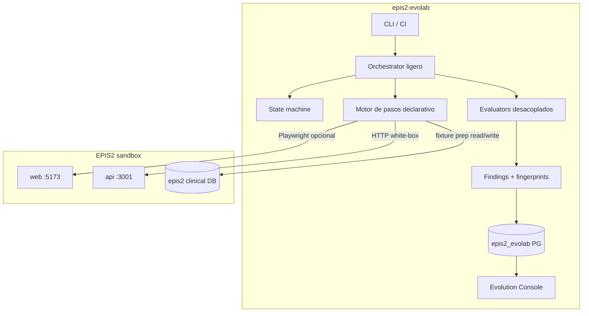

# EPIS2 Evolab — Plan de mejora optimizado

**Versión:** 2.0 (optimizada)  
**Fecha:** 2026-06-10  
**Repo:** [epis2-evolab](https://github.com/gabriel2320/epis2-evolab)  
**Target clínico:** [epis2](https://github.com/gabriel2320/epis2) (sandbox HTTP, sin acoplamiento de código)  
**Reemplaza:** v1.0 (2026-06-09) — ver §10 para diferencias

---

## 1. Resumen ejecutivo

Evolab completó el MVP (FASE 0–10): orquestador, PostgreSQL, evaluadores, replay, LLM plan/execute piloto y consola read-only. La idea está **validada**: con solo 4 escenarios encontró un gap clínico real (`discharge-critical-pending-001` — epicrisis aprobada con crítico sin acuse).

### Tesis del plan v2

La revisión de código identificó el cuello de botella real:

> **El recurso escaso no es la velocidad de los runs: es el costo de autoría de cada escenario.**

Hoy cada escenario nuevo exige un **ejecutor TypeScript artesanal** (~150–210 líneas) registrado en un `switch` en `scenarios/executor.ts`. El YAML es casi solo metadata. Por eso el plan v2 prioriza un **motor de pasos declarativo** antes que paralelismo, colas o CI avanzado: convierte "escenario nuevo = 200 líneas TS + PR" en "escenario nuevo = 1 archivo YAML".

### Baseline (2026-06-10, verificado)

| Métrica | Valor |
|---------|-------|
| Escenarios YAML | 4 (3 con ejecutor determinista + 1 plan-driven) |
| Tests unitarios | 385 verdes (806 ms) |
| Modo default | API-first (`BROWSER=false`) |
| Consola | Read-only `:5190` |
| Lint / CI | Ausentes |
| Costo escenario nuevo | ~200 líneas TS + switch + evaluador acoplado |
| Hallazgo clínico confirmado | discharge sin bloqueo con PCR crítico pendiente |

---

## 2. Principios de diseño (no negociables, sin cambios)

1. **EPIS2 no conoce Evolab** — solo HTTP/Playwright sobre sandbox.
2. **API-first, browser on demand** — Playwright solo cuando el evaluador lo exige.
3. **Determinismo antes que LLM** — el LLM propone planes, no estados.
4. **Evidencia barata, señal cara** — capturar todo solo on-fail o en debug.
5. **Human-in-the-loop** para hallazgos, test candidates y patch candidates.
6. **Reproducibilidad** — seed + replay + fingerprint en cada finding.

---

## 3. Plan por sprints (~8 semanas a valor pleno)

### Sprint 0 — Gobernanza mínima (3 días)

Barato y desbloquea todo lo demás. Corresponde a G-01–G-03 de [EVOLAB_NORMA_COMPLIANCE.md](./EVOLAB_NORMA_COMPLIANCE.md).

| ID | Entregable | Criterio de aceptación |
|----|------------|------------------------|
| S0.1 | ESLint + Prettier + `npm run lint` / `format:check` | Lint verde en todo el repo |
| S0.2 | `.nvmrc` + `"engines": { "node": ">=20" }` | `npm install` advierte en Node <20 |
| S0.3 | GitHub Actions: install → typecheck → test → boundary | PR verde sin intervención manual |
| S0.4 | Script `npm run quality` unificado | typecheck + lint + test en un comando |

**Nota:** la exención MD3 de la consola ya está documentada en NORMA_COMPLIANCE §6; no requiere ADR adicional.

---

### Sprint 1–2 — Motor de pasos declarativo (2 semanas) · **inversión central**

Reemplazar el `switch` por un intérprete genérico de pasos definidos en YAML.

**Modelo objetivo:**

```yaml
steps:
  - login: { persona: physician-intermediate }
  - api:
      label: discharge_approve_attempt
      method: POST
      path: /api/hospitalizations/{hospId}/discharge/approve
  - assert_db:
      label: critical_still_pending
      query: critical_results_pending
      demoCase: DEMO-004
  - browser:
      when: dom_state
      open: /espacio/ficha
      waitTestId: epis2-draft-review
```

| ID | Entregable | Criterio de aceptación |
|----|------------|------------------------|
| S1.1 | Intérprete de pasos (`login`, `api`, `browser`, `assert_db`, `screenshot`, `wait`) que emite `ScenarioObservation` con labels declarados | Tipos de paso cubiertos por tests unitarios |
| S1.2 | `ScenarioDefinitionSchema` v2 retrocompatible (YAML v1 sigue funcionando) | 4 YAML existentes cargan sin cambios |
| S1.3 | Migrar `role-evolution-sign-001` al motor (validación) | Mismo resultado que ejecutor TS, run E2E verde |
| S2.1 | Migrar `discharge-critical-pending-001` y `suspended-medication-mar-001` | Ejecutores TS quedan como golden reference |
| S2.2 | Evaluadores desacoplados: YAML declara `actionObservation:` en vez de labels adivinados (`discharge_approve_attempt`, `mar_approve_attempt`…) | `buildEvaluatorsForScenario` sin heurísticas por escenario |

**Por qué primero:** es el multiplicador de todo lo demás. La profundidad clínica (antes FASE 14, semanas de trabajo) pasa a costar días.

---

### Sprint 3 — Catálogo + fricción operativa (1 semana)

Con el motor listo, ampliar catálogo se vuelve barato.

| ID | Entregable | Criterio de aceptación |
|----|------------|------------------------|
| S3.1 | +4 escenarios tramo C en YAML (admisión, MAR variante, epicrisis, censo) | 8 escenarios activos sin TS nuevo |
| S3.2 | `doctor` preflight endurecido: ping API/web, seed demo, DB, Ollama opcional | Falla rápido y accionable ante API zombie `:3001` |
| S3.3 | `--reset-fixtures` integrado en PREPARE (`sandbox-prep`) | `discharge-critical-pending` reproducible N veces |

**Riesgo conocido atacado:** acuses demo persistentes y API colgada son las dos causas reales de flakiness documentadas en `evolab-known-limitations.md`.

---

### Sprint 4 — CI smoke + evidencia (1 semana)

| ID | Entregable | Criterio de aceptación |
|----|------------|------------------------|
| S4.1 | Tag `smoke` (2 escenarios API, ~60s) | Subset corre aislado |
| S4.2 | Job GHA smoke con EPIS2 como sibling checkout (`EPIS2_ROOT`) | PR Evolab verde < 8 min |
| S4.3 | `EPIS2_EVOLAB_EVIDENCE=minimal\|full`; screenshots solo on-fail | Disco/run ↓ ≥70% en minimal |
| S4.4 | Split ligero del orquestador: extraer `EvaluateRun` y `PersistRun` | `orchestrator.ts` < 300 líneas; sin refactor grande |

---

### Sprint 5–6 — Profundidad clínica con el motor (2 semanas)

| ID | Entregable | Criterio de aceptación |
|----|------------|------------------------|
| S5.1 | Evaluador CDR vs `clinical_critical_results` (cruza API alerts + DB) | Finding accionable en discharge |
| S5.2 | Evaluador audit completeness (eventos en `/api/audit` post-acción) | MAR y discharge cubiertos |
| S6.1 | Journey multi-paso `admission-discharge-001` (YAML encadenado, state carry) | 1 journey en human_review validado |
| S6.2 | Replan LLM acotado (1 retry) **solo si** los escenarios hybrid lo justifican con datos | Métrica `plan_fidelity` persistida |

---

## 4. Diferido explícitamente (no cancelado)

| Ítem | Razón | Disparador para retomarlo |
|------|-------|---------------------------|
| `--parallel` / run queue / `evolab:worker` | Con <10 escenarios API-first no es cuello de botella | Catálogo >10 y `--all` >10 min |
| Migrar consola a Fastify/React+MUI | Read-only localhost funciona; exención MD3 vigente | Consola pasa a usuarios no técnicos o necesita POST review |
| Pino + OpenTelemetry + correlationId completo | Valioso pero no genera findings | CI batch diario operando |
| Test/patch candidates LLM | Riesgo alto, valor especulativo | ≥20 findings revisados con patrones repetidos |
| Matriz persona×rol | Casi gratis con el motor declarativo | Motor estable (post Sprint 2) |
| Fault injection adapter | Útil, no urgente | Catálogo resiliente priorizado |
| Endpoint sandbox `POST /api/sandbox/fault` en EPIS2 | Opt-in, ciclo EPIS2 separado | Acuerdo explícito entre repos |

---

## 5. Métricas north-star

| Métrica | Hoy | Post Sprint 3 | Post Sprint 6 |
|---------|-----|---------------|---------------|
| Costo escenario nuevo | ~200 líneas TS | 1 archivo YAML | 1 archivo YAML |
| Escenarios activos | 4 | 8 | 10+ y 1 journey |
| CI feedback PR | manual | typecheck+test+lint | + smoke < 8 min |
| Evaluadores desacoplados | no | sí | + CDR + audit |
| Flakiness (fixture/API zombie) | manual | preflight + reset | estable en CI |

### Por run (persistir en `evolution.runs.configuration`)

| Métrica | Uso |
|---------|-----|
| `durationMs` total / por fase | Optimizar PREPARE vs ACT |
| `apiCallCount` | Detectar escenarios chatty |
| `browserSteps` | Justificar BROWSER=true |
| `llmTokens` / `llmLatencyMs` | Coste modelo |
| `evidenceBytes` | Modo minimal vs full |
| `planSteps` / `planFallback` | Calidad LLM |

---

## 6. Arquitectura objetivo



**Refactor mínimo del orquestador (S4.4):** extraer solo `EvaluateRun` y `PersistRun`; el loop maestro (PREPARE → SEED → ACT → OBSERVE → EVALUATE → REPRODUCE → HUMAN_REVIEW → COMPLETE) no cambia.

---

## 7. Riesgos y mitigaciones

| Riesgo | Impacto | Mitigación |
|--------|---------|------------|
| Motor declarativo no cubre un caso límite | Escenario bloqueado | Ejecutores TS quedan como fallback golden; tipo de paso `custom` escapable |
| Migración rompe escenarios validados | Pérdida de señal | S1.3/S2.1 exigen paridad de resultado con ejecutor TS antes de borrar nada |
| Sandbox DB sucia | Runs flaky | S3.3 reset automático + lock por `demoCaseCode` |
| API zombie `:3001` | Timeouts largos | S3.2 preflight + timeout agresivo |
| LLM no determinista | Flaky plan | Hybrid + fallback determinista + replan 1x (S6.2) |
| Scope creep hacia EPIS2 | Acoplamiento | `boundary-validate` en CI (S0.3) |

---

## 8. Dependencias con EPIS2

| Necesidad | Repo | Tipo |
|-----------|------|------|
| Sandbox estable (`stack:dev`) | epis2 | Operacional (bloqueante para smoke CI) |
| Demo cases seed | epis2 DB migrations | Contrato `@evolab/demo-fixtures` |
| Command registry sinónimos | epis2 packages | Copia/read para prompts (sin import código) |
| Fix clínico post-finding | epis2 | Ciclo separado |

**Regla:** ningún PR de Evolab en EPIS2 salvo endpoint sandbox opt-in acordado.

---

## 9. Definition of Done (por feature)

- [ ] Contrato Zod actualizado
- [ ] Migración PG inmutable (si aplica)
- [ ] Tests unitarios (+ integración PG si toca persistencia)
- [ ] `evolab:boundary:validate` verde
- [ ] Logs con `runId`
- [ ] Typecheck + lint en CI
- [ ] Documentación en `docs/evolution/`
- [ ] Sin imports clínicos EPIS2

---

## 10. Diferencias respecto a v1.0

| | v1.0 (2026-06-09) | v2.0 (este documento) |
|---|---|---|
| Tesis | Velocidad de runs primero (paralelismo FASE 11) | Costo de autoría de escenarios primero (motor declarativo) |
| Duración a valor pleno | ~16 semanas (13 sprints) | ~8 semanas (7 sprints) |
| Primer entregable clínico | FASE 14 (+6 escenarios como TS artesanal) | Sprint 3 (+4 escenarios como YAML) |
| Infraestructura especulativa | Cola, worker, Fastify, paralelo | Diferida con disparadores explícitos (§4) |
| Costo escenario nuevo al final | ~200 líneas TS | 1 archivo YAML |

Las FASES 11–15 de v1.0 no se descartan: sus ítems quedan absorbidos en sprints (doctor, evidencia, CI smoke, CDR, journey) o diferidos con disparador (§4).

---

## 11. Comandos objetivo (post Sprint 6)

```powershell
# Calidad
npm run quality                                    # typecheck + lint + test

# Operación diaria
npm run evolab:run -- --all --evidence minimal
npm run evolab:run -- --tag smoke                  # subset CI ~60s
npm run evolab:run -- --scenario tramo-c-admision-001 --reset-fixtures

# Journey
npm run evolab:run -- --journey admission-discharge-001

# Consola
npm run evolab:console                             # :5190
```

---

## 12. Referencias

- [EVOLAB_NORMA_COMPLIANCE.md](./EVOLAB_NORMA_COMPLIANCE.md) — brechas G-01…G-13
- [EVOLAB_ARCHITECTURE.md](./EVOLAB_ARCHITECTURE.md)
- [EVOLAB_BOUNDARIES.md](./EVOLAB_BOUNDARIES.md)
- [evolab-known-limitations.md](../../reports/evolution/evolab-known-limitations.md)
- [evolab-mvp-validation.md](../../reports/evolution/evolab-mvp-validation.md)

---

## 13. Próximo paso inmediato

**Sprint 0 (3 días):** ESLint + Prettier + `engines`/`.nvmrc` + workflow GHA + `npm run quality`.

Inmediatamente después, **Sprint 1:** motor de pasos declarativo, validándolo con la migración de `role-evolution-sign-001` (el más simple) con paridad de resultado y los 385 tests verdes.
